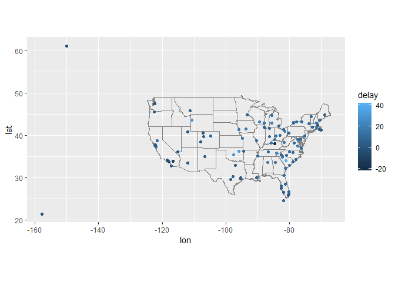
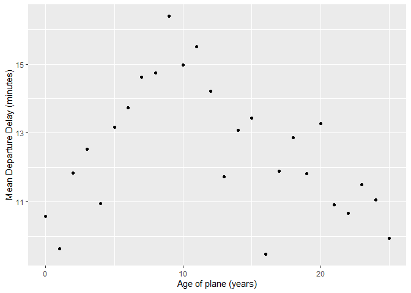
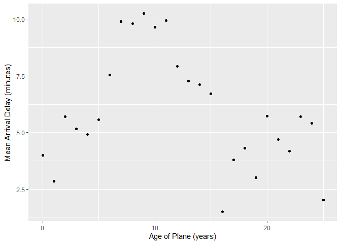

HW3
================
Yang Xiao
2022-10-17

## 1. Compute the average delay by destination, then join on the airports data frame so you can show the spatial distribution of delays.

``` r
library(nycflights13);library(ggplot2)
library(dplyr);library(tidyverse)
```

    ## 
    ## 载入程辑包：'dplyr'

    ## The following objects are masked from 'package:stats':
    ## 
    ##     filter, lag

    ## The following objects are masked from 'package:base':
    ## 
    ##     intersect, setdiff, setequal, union

    ## ── Attaching packages ─────────────────────────────────────── tidyverse 1.3.2 ──
    ## ✔ tibble  3.1.8     ✔ purrr   0.3.5
    ## ✔ tidyr   1.2.1     ✔ stringr 1.4.1
    ## ✔ readr   2.1.3     ✔ forcats 0.5.2
    ## ── Conflicts ────────────────────────────────────────── tidyverse_conflicts() ──
    ## ✖ dplyr::filter() masks stats::filter()
    ## ✖ dplyr::lag()    masks stats::lag()

``` r
airports %>%
  semi_join(flights, c("faa" = "dest")) %>%
  ggplot(aes(lon, lat)) +
  borders("state") +
  geom_point() +
  coord_quickmap()
```

<!-- -->

``` r
avg_dest_delays <- flights %>% group_by(dest) %>%
  summarise(delay = mean(arr_delay, na.rm = TRUE)) %>%
  inner_join(airports, by = c(dest = "faa"))
avg_dest_delays %>%
  ggplot(aes(lon, lat, colour = delay)) +
  borders("state") + geom_point() + coord_quickmap()
```

<!-- -->

## 2. Add the location of the origin and destination (i.e. the lat and lon) to flights.

``` r
airport_locations <- airports %>% select(faa, lat, lon)
flights %>% select(year:day, hour, origin, dest) %>%
  left_join(airport_locations, by = c("origin" = "faa")) %>%
  left_join(airport_locations, by = c("dest" = "faa"),
            suffix = c("_origin","_dest"))
```

    ## # A tibble: 336,776 × 10
    ##     year month   day  hour origin dest  lat_origin lon_origin lat_dest lon_dest
    ##    <int> <int> <int> <dbl> <chr>  <chr>      <dbl>      <dbl>    <dbl>    <dbl>
    ##  1  2013     1     1     5 EWR    IAH         40.7      -74.2     30.0    -95.3
    ##  2  2013     1     1     5 LGA    IAH         40.8      -73.9     30.0    -95.3
    ##  3  2013     1     1     5 JFK    MIA         40.6      -73.8     25.8    -80.3
    ##  4  2013     1     1     5 JFK    BQN         40.6      -73.8     NA       NA  
    ##  5  2013     1     1     6 LGA    ATL         40.8      -73.9     33.6    -84.4
    ##  6  2013     1     1     5 EWR    ORD         40.7      -74.2     42.0    -87.9
    ##  7  2013     1     1     6 EWR    FLL         40.7      -74.2     26.1    -80.2
    ##  8  2013     1     1     6 LGA    IAD         40.8      -73.9     38.9    -77.5
    ##  9  2013     1     1     6 JFK    MCO         40.6      -73.8     28.4    -81.3
    ## 10  2013     1     1     6 LGA    ORD         40.8      -73.9     42.0    -87.9
    ## # … with 336,766 more rows

## 3. Is there a relationship between the age of a plane and its delays?

To examine the relationship between aircraft age and departure delays, I
calculated the average departure and arrival delays for each flight age.

``` r
plane_cohorts <- inner_join(flights,
  select(planes, tailnum, plane_year = year),
  by = "tailnum") %>%
  mutate(age = year - plane_year) %>% filter(!is.na(age)) %>%
  mutate(age = if_else(age > 25, 25L, age)) %>%
  group_by(age) %>%
  summarise(
    dep_delay_mean = mean(dep_delay, na.rm = TRUE),
    dep_delay_sd = sd(dep_delay, na.rm = TRUE),
    arr_delay_mean = mean(arr_delay, na.rm = TRUE),
    arr_delay_sd = sd(arr_delay, na.rm = TRUE),
    n_arr_delay = sum(!is.na(arr_delay)),
    n_dep_delay = sum(!is.na(dep_delay)))
ggplot(plane_cohorts, aes(x = age, y = dep_delay_mean)) +
  geom_point() +
  scale_x_continuous("Age of plane (years)", breaks = seq(0, 30, by = 10)) +
  scale_y_continuous("Mean Departure Delay (minutes)")
```

<!-- -->

``` r
ggplot(plane_cohorts, aes(x = age, y = arr_delay_mean)) +
  geom_point() +
  scale_x_continuous("Age of Plane (years)", breaks = seq(0, 30, by = 10)) +
  scale_y_continuous("Mean Arrival Delay (minutes)")
```

<!-- -->

As the first graph shown, the average delay in departure is increasing
trend for planes under 10 years old. Departure delays decrease or level
off for aircraft older than 10 years. That could be because planes
gradually develop problems then cancel trips and out of use, or because
airlines allow enough time for the planes so mechanical problems don’t
delay them. The situation in the arrival delay is similar with the
departure delay, which shown in the second graph. There is an increasing
trend before age ten, decrease or level off after age 10.
